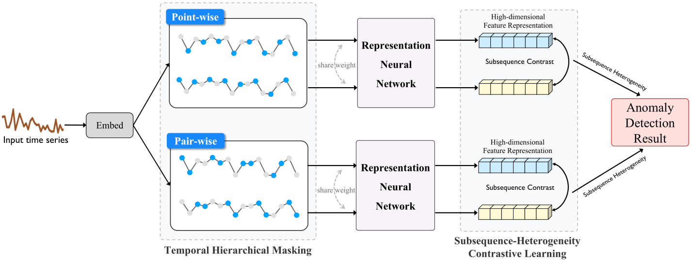
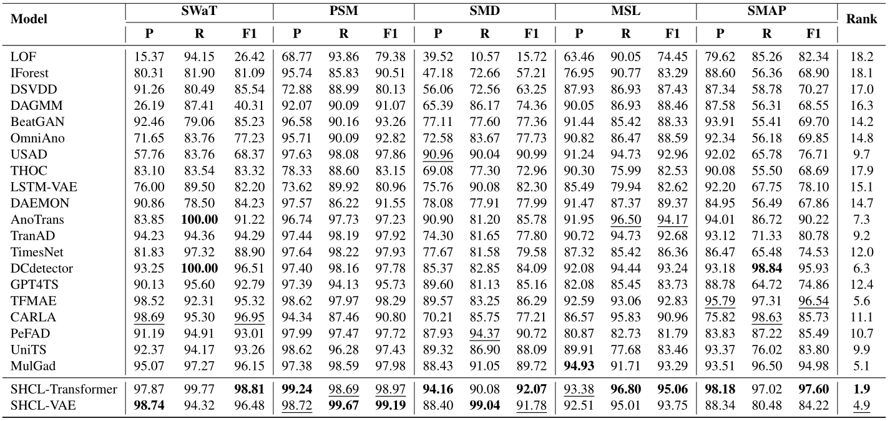
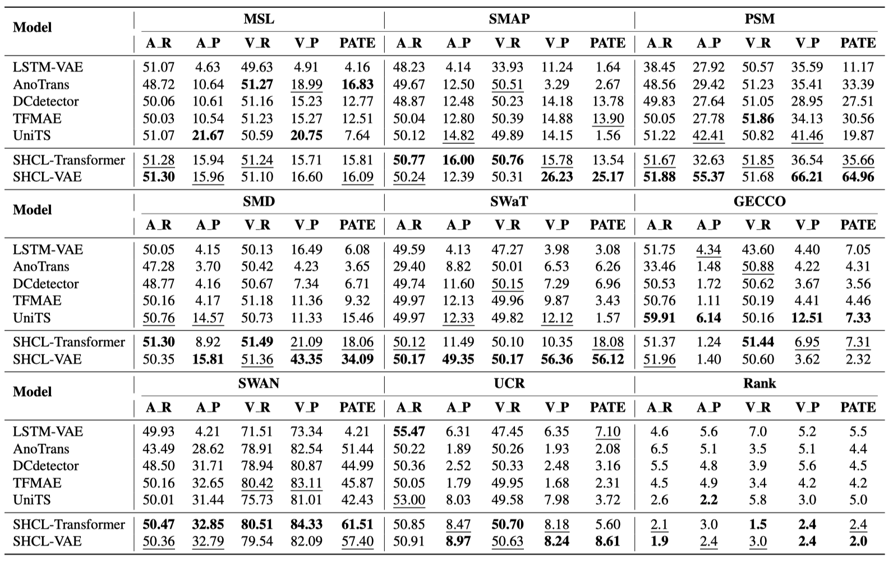

# Subsequence Heterogeneity Contrastive Learning for Time Series Anomaly Detection

This is the official repository for our paper "Subsequence Heterogeneity Contrastive Learning for Time Series Anomaly Detection". The code here is a refactored version of the implementation used in the paper, optimized for ease of use and reproducibility. By following the instructions below, you can reproduce the experimental results reported in the paper.

|  |
| :----------------------------------------------------------: |
|       *Figure 1: The workflow of the SHCL framework.*        |

## Main Results

We evaluate our SHCL model against 20 baseline methods. Extensive experiments demonstrate that SHCL achieves state-of-the-art performance on eight benchmark datasets.


|  |
| :----------------------------------------------------------: |
| *Table 1: Performance comparison of anomaly detection models* |


|  |
| :----------------------------------------------------------: |
| *Table 2: Multi-metrics comparison on eight real-world datasets.* |

## Code Description

This repository provides a complete implementation of SHCL-VAE, including functionality for training, validation, and testing. You can modify the model components (e.g., in the `model` directory) to experiment with alternative neural network architectures and evaluate their performance as representation networks. The code structure is organized as follows:

- **cpt/**: Directory for storing model checkpoints and weights. You can load pre-trained weights from here to test performance without retraining.
- **data_factory/**: Contains preprocessing scripts and utilities for all datasets.
- **dataset/**: Directory for storing datasets. Download the public benchmarks from [this Google Drive link](https://drive.google.com/drive/folders/1RaIJQ8esoWuhyphhmMaH-VCDh-WIluRR?usp=sharing) and place them here.
- **img/**: Contains images used in this README (e.g., figures and tables).
- **main.py**: The entry point script. Configure all hyperparameters and experiment settings here (e.g., dataset selection, model architecture, training epochs).
- **metrics/**: Directory with evaluation metric implementations, including VUS (Volume Under the Surface), affiliation precision/recall, and standard metrics like precision, recall, and F1-score.
- **model/**: Core implementation of the SHCL model. Refer to Section 4 of the paper for detailed correspondence to the methodology.
- **result/**: Automatically saves experiment results, training logs, and validation metrics during runs.
- **scripts/**: Bash scripts for reproducing experiments on specific datasets and ablation studies. Use these as a starting point for replication.
- **solver.py**: Handles the core logic for training, validation, and testing loops.
- **requirements.txt**: Lists all required Python packages for running the code.

## Getting Started

To reproduce the results, follow these steps carefully. We recommend using a virtual environment to manage dependencies.

### 1. Prerequisites
- Python 3.8 or higher (tested with Python 3.6–3.10).
- PyTorch >= 1.4.0 (GPU support recommended for faster training; ensure CUDA is installed if using a GPU).
- A machine with sufficient RAM and GPU resources (e.g., at least 8GB GPU VRAM for larger datasets).

### 2. Set Up the Environment
Clone the repository and install dependencies:

```bash
git clone https://github.com/Zhangzzbzzb/SHCL.git  # Replace with your repo URL
cd SHCL
```

Create and activate a virtual environment (optional but recommended):

```bash
conda create -n shcl-env python=3.8 -y
conda activate shcl-env
```

Install the required packages:

```bash
pip install -r requirements.txt
```

### 3. Download Datasets
Download the benchmark datasets from [this Google Drive folder](https://drive.google.com/drive/folders/1RaIJQ8esoWuhyphhmMaH-VCDh-WIluRR?usp=sharing). Extract the files and place them in the `dataset/` directory. The structure should look like this:

```
dataset/
├── SMD/
├── MSL/
├── SMAP/
├── PSM/
├── SWAT/
└── ... (other datasets)
```

Ensure all datasets are preprocessed using the scripts in `data_factory/` if needed (most are ready-to-use after download).

### 4. Train and Evaluate
The repository includes bash scripts in the `scripts/` directory for easy reproduction on each dataset. These scripts handle training, validation, and testing with default hyperparameters from the paper.

To reproduce results for a specific dataset (e.g., SMD):

```bash
bash scripts/PSM.sh
```

This will:
- Load the PSM dataset from `dataset/PSM/`.
- Train the SHCL-VAE model using parameters defined in `main.py`.
- Perform validation during training.
- Evaluate on the test set using metrics from `metrics/`.
- Save checkpoints to `cpt/`, logs and results to `result/`.

Repeat for other datasets:

```bash
bash scripts/MSL.sh
bash scripts/SMAP.sh
bash scripts/SMD.sh
bash scripts/SWAT.sh
```

For custom experiments:
- Edit `main.py` to adjust hyperparameters (e.g., learning rate, batch size, number of epochs).
- Run manually: `python main.py --dataset SMD --mode train` (check `main.py` for available arguments).
- For testing with pre-trained weights: Load from `cpt/` and run `python main.py --dataset SMD --mode test --load_checkpoint path/to/checkpoint.pth`.

To test alternative models:
- Modify files in `model/` (e.g., replace the VAE backbone with another encoder).
- Update `main.py` to point to the new model class.

### Troubleshooting
- **Out-of-Memory Errors**: Reduce batch size in `main.py` or use a smaller dataset subset.
- **Dependency Issues**: Ensure PyTorch matches your CUDA version.
- **Dataset Not Found**: Double-check the `dataset/` path and file integrity after download.
- For issues, check the logs in `result/` or open an issue in the repository.

## License
This project is licensed under the MIT License - see the LICENSE file for details.

## Contributing
Contributions are welcome! Please submit pull requests for bug fixes, improvements, or new features. Follow standard GitHub workflows: fork, branch, commit, PR.

## Citation

```bibtex
@article{SHCL2026,
	title = {Subsequence heterogeneity contrastive learning for time series anomaly detection},
	journal = {Information Sciences},
	volume = {723},
	pages = {122680},
	year = {2026},
	issn = {0020-0255},
	doi = {https://doi.org/10.1016/j.ins.2025.122680},
	author = {Zhibin Zhang and Xiaohong Zhang and Qiang Li and Chun Huang and Tao Yin and Meng Yan}
}
```